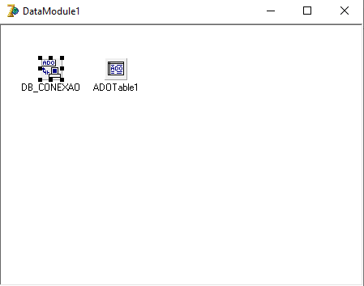

# Conexão Com O Banco de Dados SqlServer

- Utilizando o componente ADOConnection da Aba ADO do Delphi7:

- De um duplo clique sobre o componente:

- Clique em Build:

- Selecione está opção para utilizar o sqlserver

- Agora será configurado os dados do servidor sql server:

Configure exatamente assim, apenas trocando o nome do servidor, que se encontra no sqlserver manager ao abri-lo, e o banco de dados que você criou.

- Após Isso Aperte ok, e a conexão foi concluida